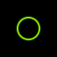
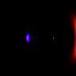
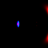

# AdS black-hole ray tracer

Python ray tracing for null geodesics in pure AdS, Schwarzschild–AdS, Kerr–AdS, and user-supplied 3+1-dimensional metrics.

| Schwarzschild–AdS | Kerr–AdS: $\Omega_HL=0.50$ | Kerr–AdS: $\Omega_HL=0.80$ | Kerr–AdS: $\Omega_HL=0.98$ |
|---|---|---|---|
|  |  |  |  |

## Install

```bash
python3 -m venv .venv
source .venv/bin/activate
python -m pip install -e .[dev]
```

## Run

```bash
pytest -q
adsrt render examples/configs/schwarzschild_ads.json
python examples/run_continuity_experiment.py --preset misaligned --width 32 --height 32 --workers 8
```

The continuity runner accepts custom spin targets, for example:

```bash
python examples/run_continuity_experiment.py --targets 0,0.3,0.5,0.8,0.98,1.2
```

More details are in [`docs/DETAILED_README.md`](docs/DETAILED_README.md) and [`docs/LOCAL_RUN_AND_CONTINUITY_EXPERIMENT.md`](docs/LOCAL_RUN_AND_CONTINUITY_EXPERIMENT.md).
